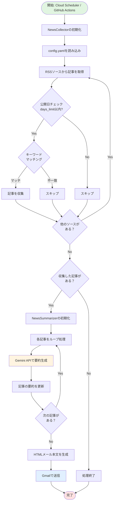
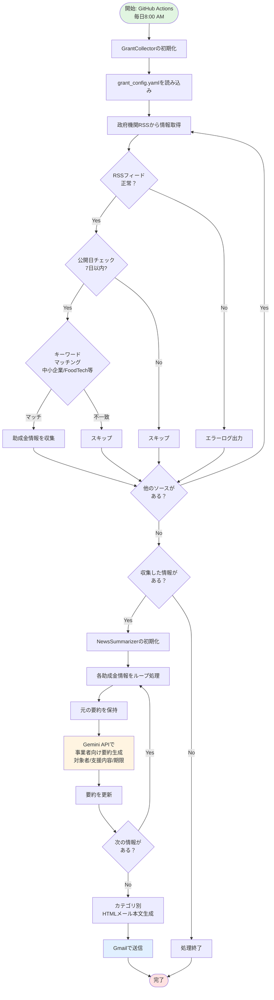

# Tech News Collector

GCPを活用して、毎日技術ニュースを収集・蓄積し、メールで通知するシステム。
さらに、助成金・補助金情報も別途収集・配信します。

## 概要 (Draft)

### 1. 目的
毎日決まった時間に技術ニュースと助成金情報を自動で収集し、データベースに蓄積するとともに、要約などをメールで受け取る。

#### 2つの配信システム
1. **技術ニュース配信** (`src/main.py`)
   - 技術記事、ビジネス、FoodTechなどの最新ニュースを収集
   - 毎日8:00 AM（日本時間）に配信

2. **助成金情報配信** (`src/grant_main.py`) ✨ NEW
   - 中小企業、スタートアップ、フードテック、食産業、食文化、地域創生に関連する助成金・補助金情報を収集
   - 毎日8:00 AM（日本時間）に配信
   - 過去7日分の新着情報をキーワードフィルタリング

### 2. アーキテクチャ詳細

コストと開発のしやすさを重視した構成です。

```mermaid
graph TD
    Scheduler[Cloud Scheduler] -->|毎日 8:00 AM| Function[Cloud Functions (Python)]
    
    subgraph "Cloud Functions 処理"
        Function -->|1. 収集| RSS[RSS / Web APIs]
        Function -->|2. 要約| Gemini[Vertex AI (Gemini 1.5 Flash)]
        Function -->|3. 保存| DB[(Firestore)]
        Function -->|4. 送信| Mail[SendGrid / Gmail]
    end
    
    DB -->|重複チェック| Function
    Mail -->|HTMLメール| User((User))
```

#### 各コンポーネントの役割

1.  **Cloud Scheduler**
    *   **役割**: 定期実行のトリガー。
    *   **設定**: Cron形式で `0 8 * * *` (毎日朝8時) など。
    *   **ターゲット**: Cloud Functions の HTTP エンドポイントを叩く。

2.  **Cloud Functions (第2世代)**
    *   **役割**: メインの処理ロジック。
    *   **ランタイム**: Python 3.11
    *   **処理内容**:
        *   `feedparser` 等でRSS/APIから記事を取得。
        *   Firestore を確認し、すでに通知済みの記事はスキップ（重複排除）。
        *   Vertex AI (Gemini) に記事本文またはタイトルを投げ、3行要約を生成。
        *   Firestore に結果を保存。
        *   メール本文（HTML）を生成し送信。

3.  **Google Cloud Firestore**
    *   **役割**: データの蓄積、重複防止。
    *   **コレクション設計**: `articles` コレクション
        *   `id`: URLのハッシュ値など (重複防止用)
        *   `title`: 記事タイトル
        *   `url`: 記事URL
        *   `summary`: AIによる要約
        *   `published_at`: 記事公開日
        *   `created_at`: 収集日時
        *   `tags`: カテゴリタグ (AIで付与)

4.  **Vertex AI (Gemini 1.5 Flash)**
    *   **役割**: コンテンツの理解。
    *   **モデル**: `gemini-1.5-flash` (高速・安価で要約タスクに最適)
    *   **プロンプト例**: 「以下の技術記事のタイトルと冒頭文から、エンジニア向けに要約を3点の箇条書きで作成してください。」

5.  **メール配信 (SendGrid 推奨)**
    *   **役割**: ユーザーへの通知。
    *   **理由**: 確実に届く、HTMLメールが作りやすい、ログが見れる。
    *   **代替案**: Gmail SMTP (設定は楽だが、セキュリティ制限に引っかかることがある)。

### 3. 処理フロー

#### 技術ニュース収集フロー



1. Cloud Scheduler が Cloud Functions をトリガー
2. 指定されたソースからニュースを取得
3. (オプション) LLM (Geminiなど) で要約・フィルタリング
4. データベースに保存 (重複チェック含む)
5. メール本文を作成し送信

#### 助成金情報収集フロー ✨ NEW



1. GitHub Actions が毎日8:00 AMに実行
2. 政府機関・自治体のRSSフィードから助成金情報を収集
3. キーワードでフィルタリング（中小企業、スタートアップ、フードテック等）
4. Gemini AIで事業者向けに要約（対象者、支援内容、期限等を明確化）
5. HTMLメールで配信

### 4. 助成金情報ソース

助成金情報は以下の公式ソースから収集します：

#### 中小企業・スタートアップ支援
- **中小企業庁**: 公式RSS (https://www.chusho.meti.go.jp/rss/web.xml)
- **J-Net21 (中小機構)**: 補助金活用ナビ RSS (https://j-net21.smrj.go.jp/rss/index.rdf)

#### フードテック・食産業支援
- **農林水産省**: 新着情報 RSS (https://www.maff.go.jp/j/rss/index.rdf)
- **経済産業省 関東経済産業局**: フードテック関連 (https://www.kanto.meti.go.jp/rss/index.rdf)

#### 地域創生支援
- **総務省 地域力創造**: RSS (https://www.soumu.go.jp/main_sosiki/jichi_gyousei/c-gyousei/rss/index.xml)
- **内閣府 地方創生推進事務局**: RSS (https://www.chisou.go.jp/tiiki/index.rdf)

設定は `grant_config.yaml` で管理されています。

## 検討事項
- ニュースソースはどこにするか？
- AIによる要約は必要か？
- メールの配信サービスは何を使うか？

## コスト試算 (個人開発レベル)

GCPの無料枠 (Free Tier) をうまく使えば、**ほぼ0円** で運用可能です。

| サービス | 想定使用量 | 無料枠 / コスト感 | 判定 |
| --- | --- | --- | --- |
| **Cloud Scheduler** | 月30回実行 | 月3ジョブまで無料 | **¥0** |
| **Cloud Functions** | 1日数分の処理 | 月200万回呼び出し、40万GB秒メモリなど | **¥0** |
| **Firestore** | 毎日数十件保存 | 1GB保存、1日2万書き込みまで無料 | **¥0** |
| **Vertex AI (Gemini)** | ニュース要約 | 入力/出力文字数による (Gemini 1.5 Flash等は非常に安価) | **数円〜数十円/月** (または無料枠) |
| **SendGrid** | 毎日1通送信 | 1日100通まで無料 | **¥0** |

※ 注意: 完全に無料を保証するものではなく、設定ミスや大量アクセスで課金される可能性はあります。予算アラートの設定を推奨します。

## 使い方

### 前提条件
- Python 3.11+
- Google API Key または Google Cloud Project (Gemini AI用)
- Gmail アカウント (メール送信用)

### セットアップ

1. **依存関係のインストール**
```bash
pip install -r requirements.txt
```

2. **環境変数の設定**
`.env` ファイルを作成し、以下を設定：
```
GMAIL_USER=your-email@gmail.com
GMAIL_APP_PASSWORD=your-app-password
GOOGLE_API_KEY=your-google-api-key
# または
GOOGLE_CLOUD_PROJECT=your-project-id
```

3. **設定ファイルの編集**
- `config.yaml`: 技術ニュースの配信先やキーワード
- `grant_config.yaml`: 助成金情報の配信先やキーワード

### ローカルでの実行

**技術ニュース収集**
```bash
python src/main.py
```

**助成金情報収集**
```bash
python src/grant_main.py
```

### GitHub Actionsでの自動実行

リポジトリのSecretsに以下を設定：
- `GMAIL_USER`
- `GMAIL_APP_PASSWORD`
- `GOOGLE_API_KEY`
- `GOOGLE_CLOUD_PROJECT` (オプション)

ワークフローは毎日8:00 AM（日本時間）に自動実行されます：
- `.github/workflows/daily_news.yml`: 技術ニュース
- `.github/workflows/daily_grants.yml`: 助成金情報

手動実行も可能です（ActionsタブからWorkflow Dispatchを選択）。
